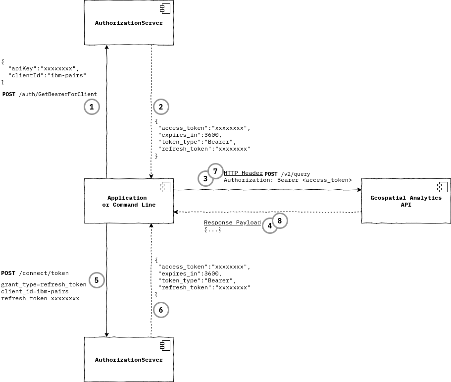

# Geospatial Analytics API

## Authentication

1. [Overview](#overview)
2. [Get an access token](#obtaining-an-access-token1)
3. [Refresh an access token](#refreshing-an-access-token)

### Overview
Geospatial Analytics API endpoints require an authenticated access token to be provided as an
HTTP Authorization header Bearer realm. For example:

``` text
Authorization: Bearer <JSON Web Token>
```
* *See* [Obtaining an access token](#obtaining-an-access-token1)<sup>1</sup>

Geospatial Analytics uses the IBM Environmental Intelligence Suite authorization server to provide API access.
The Environmental Intelligence Suite authorization server implements standard OAuth 2.0 and OpenId Connect 1.0 protocols.

Authorization server endpoints are located at the base Uri:
- [https://auth-b2b-twc.ibm.com/](https://auth-b2b-twc.ibm.com/)

An OpenId Connect discovery document for the authorization server is located at the Uri:
- [https://auth-b2b-twc.ibm.com/.well-known/openid-configuration](https://auth-b2b-twc.ibm.com/.well-known/openid-configuration)

To make Geospatial Analytics API requests an API key is provided to obtain an access token
which is then used in API requests to confirm authentication and to execute further authorization controls.

Geospatial Analytics API requests are secured by access token validation. The following diagram illustrates the API key usage flow
for just one of the Geospatial Analytics APIs: `/v2/query`. The section [Obtaining an Access Token](#obtaining-an-access-token1)<sup>1</sup> further
below provides details.



1. Call the authorization server endpoint to obtain an authenticated access token with your API key
2. The JSON response contains a property `access_token` which will be used as the "`Authorization: Bearer xxxxxxxx`" HTTP header value
2.1. The JSON property `refresh_token` value is kept for later use in `#5` below.
3. Requests to the Geospatial Analytics API shall be submitted to the applicable API endpoint with "`Authorization: Bearer xxxxxxxx`"
4. Geospatial Analytics API response payload
5. The access token obtained in `#2` has expired, a request for a new token is made using the `refresh_token` value
6. The JSON response contains properties `access_token` and `refresh_token` as in `#2` above
7. The new access token is used for Geospatial Analytics API requests
8. Geospatial Analytics API response payload; and the process to make API requests and refresh access token continues

### Obtaining an Access Token<sup>1</sup>
* **Tutorial examples where an access token is used**
    * See *`<ACCESS_JWT>`* in:
        * [Registration Part # 1 - Platform metadata](./custom-geospatial-query-extension.md#access-jwt-ex1)
        * [Registration Part # 2 - Visualization metadata](./custom-geospatial-query-extension.md#access-jwt-ex2)
        * [Merge the new job with original `baseComputationId`](./custom-geospatial-query-extension.md#access-jwt-ex3)

**Linux, macOS**

``` shell
curl -X POST \
         --url https://auth-b2b-twc.ibm.com/auth/GetBearerForClient \
         -H "Content-Type: application/json" \
         -d '{"apiKey":"<YOUR API KEY>", "clientId":"ibm-pairs"}'
```

**PowerShell<sup>2,3,4</sup>**

``` shell
curl.exe -X POST `
         --url https://auth-b2b-twc.ibm.com/auth/GetBearerForClient `
         -H "Content-Type: application/json" `
         -d '{\"apiKey\":\"<YOUR API KEY>\", \"clientId\":\"ibm-pairs\"}'
```

The result of **POST** `/auth/GetBearerForClient` will produce:

``` json
{
 "access_token":"<ACCESS_JWT>",
 "expires_in":3600,
 "token_type":"Bearer",
 "refresh_token":"<REFERSH TOKEN>",
 "scope":"custom.profile email ibm-pairs-api offline_access openid phoenix-api profile"
}
```

Where; the response payload value for property `access_token`, i.e. `<ACCESS_JWT>`, is used in the example below
which submits a Geospatial Analytics API query request.

In this example, the value of the `access_token` property in the response above is used as the value for
the`Authorization` header Bearer realm in a request to the Geospatial Analytics API `/v2/query` endpoint.

**Linux, macOS**
``` shell
curl --request POST \
     --url https://pairs.res.ibm.com/v2/query \
     --header 'Content-Type: application/json' \
     --header 'Authorization: Bearer <ACCESS_JWT>' \
     --data '{...omitted for brevity...}'
```

**PowerShell<sup>2,3,4</sup>**
``` shell
curl.exe --request POST `
     --url https://pairs.res.ibm.com/v2/query `
     --header 'Content-Type: application/json' `
     --header 'Authorization: Bearer <ACCESS_JWT>' `
     --data '{...omitted for brevity...}'
```

### Refreshing an Access Token

For scenarios where usage of an access token is longer than the default token expiry of 1 hour,
Geospatial Analytics API requests will respond with a *`403` Forbidden* code and an error data payload:

`{"error":"jwt signature verification failed: 'exp' claim expired at Mon, 4 Jan 2021 10:27:37 GMT"}`

When an access token expires, the `refresh_token` property value of `/auth/GetBearerForClient` and
`/connect/token` JSON responses can be used to request a new `access_token` without re-authenticating
with your API key as follows:

**Linux, macOS**
``` shell
curl --request POST \
     --url https://auth-b2b-twc.ibm.com/connect/token \
     --header 'Content-Type: application/x-www-form-urlencoded' \
     --data-urlencode "grant_type=refresh_token" \
     --data-urlencode "client_id=ibm-pairs" \
     --data-urlencode "refresh_token=<REFRESH TOKEN>"
```

**PowerShell<sup>2,3,4</sup>**
``` shell
curl.exe --request POST `
     --url https://auth-b2b-twc.ibm.com/connect/token `
     --header 'Content-Type: application/x-www-form-urlencoded' `
     --data-urlencode "grant_type=refresh_token" `
     --data-urlencode "client_id=ibm-pairs" `
     --data-urlencode "refresh_token=<REFRESH TOKEN>"
```

The result of **POST** `/connect/token` will produce a JSON response payload with a new `access_token` and
`refresh_token` to use in subsequent Geospatial Analytics API and authorization server requests
where applicable..

---
<a id='user-content-sup-1' href='#sup-1'></a>
<sup>1</sup> [`JSON Web Token`](https://en.wikipedia.org/wiki/JSON_Web_Token)<br>
<a id='user-content-sup-2' href='#sup-2'></a>
<sup>2</sup> Backtick/Backquote `` ` `` [PowerShell Quoting Rules](https://docs.microsoft.com/en-us/powershell/module/microsoft.powershell.core/about/about_quoting_rules)<br>
<a id='user-content-sup-3' href='#sup-3'></a>
<sup>3</sup> When pasting from the clipboard into PowerShell, double quotes (`"`) should be escaped (`\"`)<br>
<a id='user-content-sup-4' href='#sup-4'></a>
<sup>4</sup> [Tar and Curl Come to Windows!](https://techcommunity.microsoft.com/t5/containers/tar-and-curl-come-to-windows/ba-p/382409)
